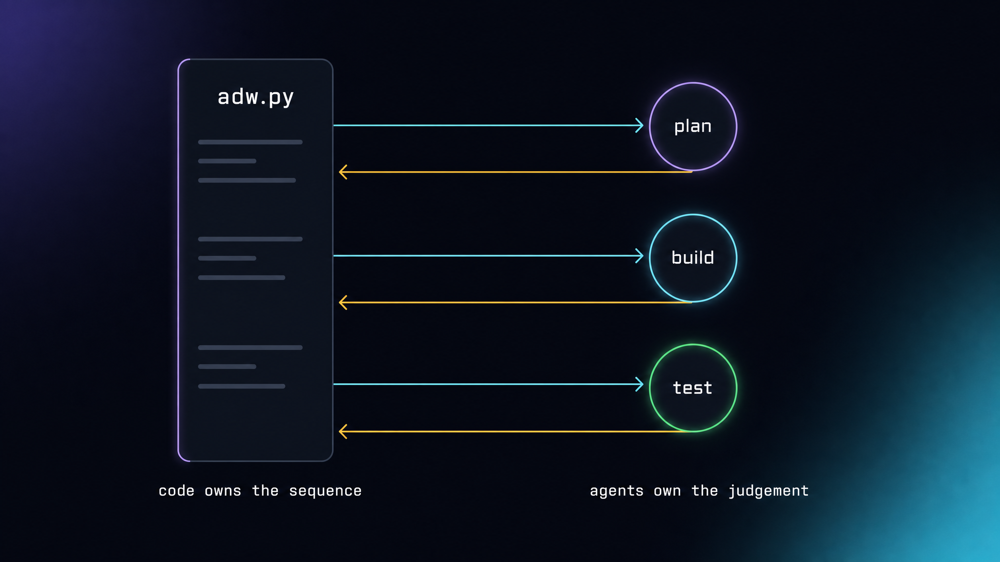
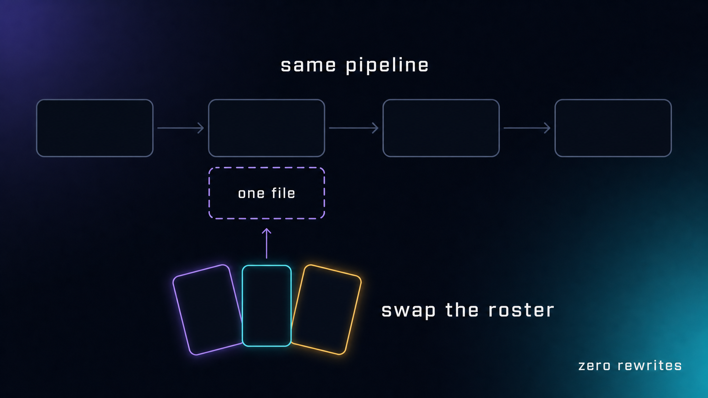
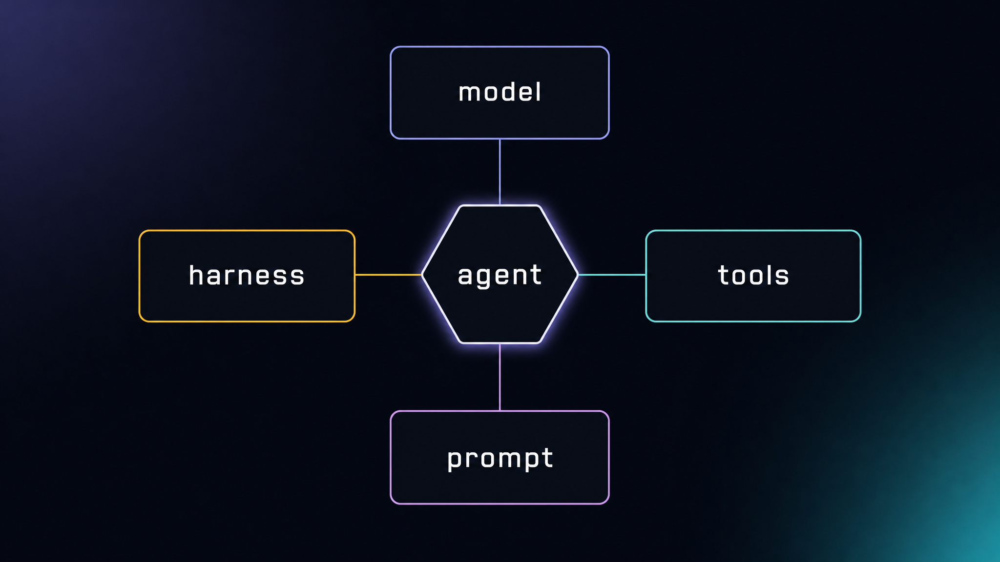
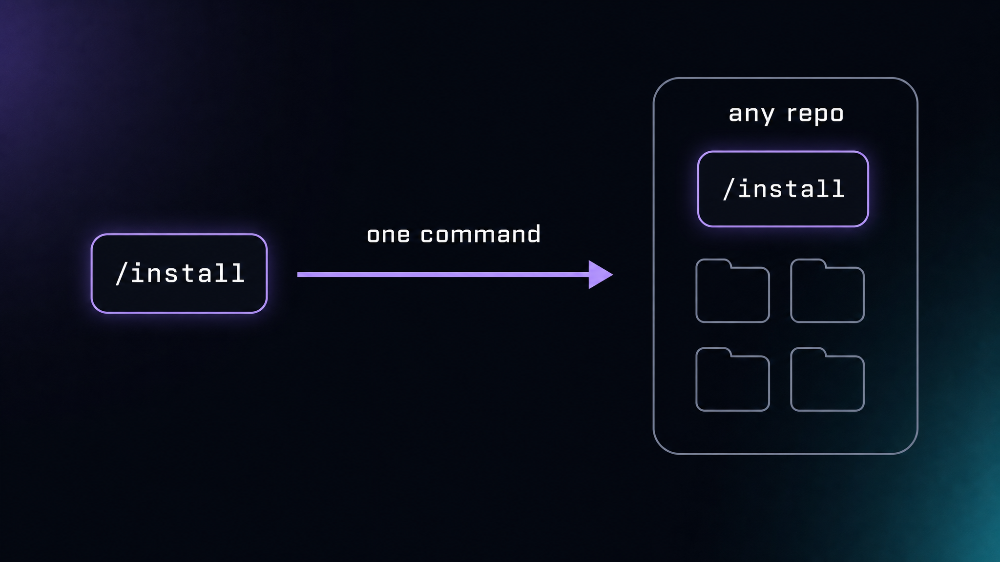
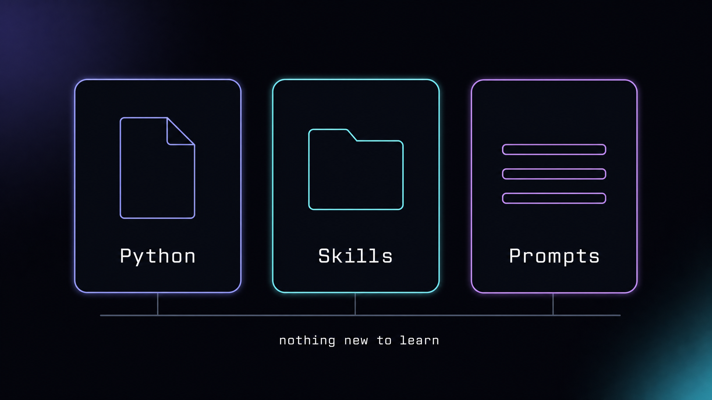
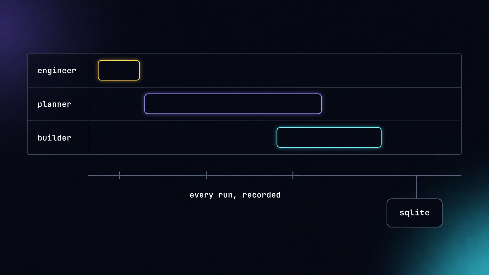

# Why this system

Most agent frameworks ask you to move into them. You learn their abstractions,
adopt their runtime, and hand them your control flow. When something goes wrong
at 2am, you are debugging their orchestrator instead of your software.

The Super Simple Software Factory inverts that. **Your code keeps the control
flow. Agents supply the judgement.** Everything below follows from that one
decision.

---

## Code plus agents together



An ADW is a Python script. It reads top to bottom. Phases run in the order you
wrote them, because a `for` loop is a `for` loop:

```python
with run.phase(PhaseParams(name="build", kind="agent", owner="builder", ...)) as ph:
    previous = ph.call(AgentCall(output_type=BuildOutput, prompt=prompt,
                                 gates=[gates.artifacts_exist]))
```

The agent is a **bounded node inside that flow**, not the thing driving it. It
gets a prompt, a tool allowlist, and a typed output contract. It returns a
validated envelope or the phase fails. There is no hidden planner deciding what
runs next, no emergent loop to reverse-engineer.

This is the difference between *code that calls agents* and *an agent that
calls your code*. The first is a program you can read, diff, test, and pin to a
commit. The second is a system whose behavior you infer.

Sequencing, retries, branching, and failure handling stay where engineers
already know how to reason about them — in the script.

---

## Highly adaptable and extensible



The roster lives in one YAML file. The ADW scripts never name a model.

```
uv run adws/adw_plan_build_test.py "<request>" \
  --config adws/adw_sssf_config/sssf.frontier.config.yaml
```

That flag is the entire migration from a cheap local roster to a frontier one.
Same scripts, same prompts, same gates, same trace, same visualizer — different
minds doing the work. Two configs ship in this repo:

| config | roster | for |
|---|---|---|
| `sssf.config.yaml` | Gemini 3.6 Flash across the board | iteration speed, cost floor |
| `sssf.frontier.config.yaml` | Opus 5 plans · Kimi K3 builds · GPT-5.6 Sol scouts | hard problems, high thinking |

Because runs land in the same trace database, you can put a frontier run and a
budget run side by side and compare what the extra spend actually bought.

Extending is additive in the same way. A new agent is a config block plus two
markdown files. A new capability is a TypeScript extension listed under
`harness_engineering`. A new workflow is a new Python script. Nothing forks.

---

## Agents are customizable — the core four



Every agent in the factory is defined by exactly four dials. Learn these and you
can build any agent the system can express.

**1. Model selection — model + thinking.**
Which mind, and how hard it deliberates. `claude-opus-5` at `thinking: high` for
planning; something fast and cheap at `thinking: low` for running tests. Cast
each role to a model's actual strength instead of paying frontier prices to
`grep`.

**2. Prompt engineering — system + user.**
`system.md` is static identity: purpose and standing instructions. `user.md` is
the task: the variables it receives, what to do, and the exact JSON `Report` it
must return. That report is one leg of the output-contract triad — the Pydantic
type, the example in `user.md`, and the `output_type=` at the call site all name
the same shape, so a malformed response is caught, not propagated.

**3. Harness engineering — tools, patterns, commands.**
Extensions loaded into the agent's harness. The planner and scout load
`subagents.ts` and gain four `subagent_*` tools; the builder doesn't and can't.
Capability is granted at the config layer, not requested in a prompt.

**4. Tool selection.**
An allowlist per agent. The reviewer gets `read`, `grep`, `find`, `ls`, `bash`
and `write` — and no `edit`. "Change nothing" isn't a polite instruction it
might ignore under pressure; it is structurally impossible. The builder is the
only agent that can mutate the repo.

Four dials, one YAML block, no code change:

```yaml
- name: reviewer
  model: anthropic/claude-opus-5
  thinking: high
  tools: [read, grep, find, ls, bash, write]   # no edit — cannot fix, only report
```

---

## Rapidly installable



The factory ships as a Claude Code skill. Point it at a repository and it stamps
in the ADW scripts, the modules, the prompts, the config, and the visualizer —
wired and runnable.

There is no service to stand up, no account to create, no daemon, no vendor
runtime. The trace is a SQLite file in your repo. The visualizer is a Bun server
and a Vite app you run when you want them.

You are not adopting a platform. You are adding files to your project, and you
can read every one of them.

---

## In-distribution primitives



Everything here is built from three things a working engineer already runs:

- **Python** — the ADWs, the modules, the gates. Plain scripts with `uv run`.
- **Skills** — the install and update flow, in Claude Code's own format.
- **Prompts** — markdown files you open in your editor and edit by hand.

No DSL. No graph builder. No YAML that secretly compiles to a state machine. No
proprietary config language whose semantics live in someone else's docs.

This matters more than it sounds. In-distribution primitives mean **the models
already know how to work on this system.** Ask an agent to add a phase to an ADW
and it is writing ordinary Python against ordinary markdown — the most
well-represented thing in its training data. The factory can extend itself
because it is made of the same material as everything else it has ever seen.

It also means onboarding is reading, not studying. A senior engineer can open
`adws/adw_plan_build_test.py`, understand the whole pipeline in a minute, and
change it with confidence.

---

## Observability out of the box



You do not instrument anything. Running an ADW produces the trace.

Every phase, every agent, every tool call, every gate check, every envelope, and
every token lands in `sssf.db` as it happens. The visualizer polls it and draws
the run as swim lanes on a real time axis: who did what, in what order, for how
long.

Open any phase and it tells you:

- **Agent config** — the four dials that were actually in effect for that run
- **Compiled prompts** — the exact system and user text that was sent, not a template
- **Gates** — per-item evidence, so a green gate says *what* it verified
- **Cost** — input, output, thinking, cache read, cache write, with the dollars for each
- **Context** — how full the window was when the agent stopped

That last pair is where the money hides. A recent planner run billed **509,998
tokens for $0.0683** — and ended holding only **51,166 tokens**, 5% of its
window. The gap is prompt caching: 400,154 of those tokens were cache reads at a
quarter the input rate. Without them the same run costs roughly 2.3× more.

You cannot reason about that from a total. Cost, context, and cache are separate
numbers because they answer separate questions — *what did this cost*, *is this
agent about to compact*, *is my prompt prefix stable enough to stay cached* —
and the factory records all three on every run, automatically, forever.
